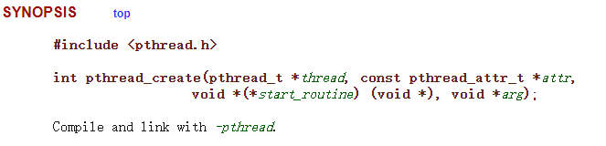
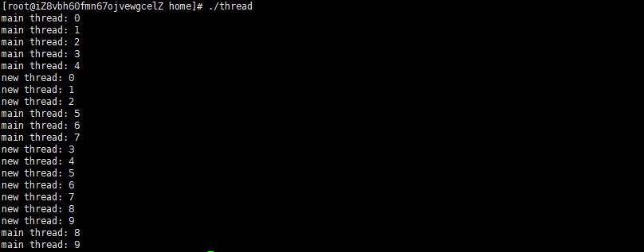

# pthread_create

### 简介

**pthread_create**是**UNIX**操作系统创建**线程**的函数，


主要用来在系统种启动一个线程（实际上就是确定调用该线程函数的入口点）



```c
int pthread_create(
    pthread_t *thread, 
    const pthread_attr_t *attr,
    void *(*start_routine) (void *), 
    void *arg
);
```

使用时需要在导入头文件

```c
#include<pthread.h>
```

第一个参数 **pthread_t *thread**：把成功创建线程的 **id** 赋给传入变量，通过这个传入的变量，可以拿到该线程的id

第二个参数 **const pthread_attr_t *attr**：线程属性，初学可传入NULL，使用默认属性。

第三个参数 **void *(*start_routine) (void *)**：线程的启动后的主体函数，需要自己定义一个函数，然后传函数名即可。

第四个参数 **void *arg** ：主体函数的参数 ，没有可直接传NULL


成功创建线程，则返回 0，若失败，则返回出错编号


### 实例

```c
#include<stdio.h>
//引入头文件
#include<pthread.h>


//定义接受线程id的变量
pthread_t pid;

//定义线程主体函数
void* thread_entity(void *arg){
    
    int i;
    
    for(i = 0; i < 100; i++){
        printf("new thread: %d\n",i);
    }
}

int main(){
    
    int i;
    //调用pthread_create创建一个线程
    pthread_create(&pid, NULL, thread_entity, NULL);
    
    for(i = 0; i < 100; i++){
        printf("main thread: %d\n",i);
    }
    
    return 0;
}
```

编译

```shell
gcc thread.c -o thread -lpthread
```


运行

```shell
./thread
```



可以看到主线程和新建线程交替打印。需要注意的是，在linux下主线程结束，如果不设置主线程阻塞，等待其他线程，则主线程启动的其他线程也会结束（**其实是主线程return后，调用glibc库函数exit，exit做完清理工作之后调用_exit系统调用退出改进程，进程结束，会结束该进程的所有线程**）


### 总结

知道这个有什么用呢？

其实java 启动一个线程底层用的就是这个函数，java的线程和系统线程其实1：1，深入学习java线程离不开与系统层面线程结合。