# synchronized

### 前言

**synchronized** 是 **Java** 关键字之一，常用于并发业务中，主要是对某对象上锁，以保证某段代码在多线程能安全运行，避免出现线程资源混乱。

随着 Java 的发展，**synchronized** 也不断被优化，不再像最初那样单一锁法，**JDK1.6**之后，**synchronized** 里面包含了三种级别锁：**偏向锁、轻量锁、重量锁**。每种锁的所带来的效率完全不一样，可以说是天差地别。因此有必要了解一下**synchronized** 的原理。


### 用法

简单几种用法

```java
public class SyncExample {
    
    private final MyLock myLock = new MyLock();

    /**
     * 用法 1
     * 在方法上添加，锁住对象为 this
     */
    public synchronized void one(){

        System.out.println("one");
    }

    /**
     * 用法 2
     * 在方法内使用，锁住对象为 this
     */
    public void second(){
        
        synchronized (this){
            System.out.println("second");
        }
        
    }

    /**
     * 用法 3
     * 锁住某块代码，锁住自定义对象
     */
    public void third(){
        
        synchronized (myLock){
            System.out.println("third");
        }
        
    }

    public static void main(String[] args) {

        SyncExample syncExample = new SyncExample();
        syncExample.one();
        syncExample.second();
        syncExample.third();
    }
}

```

需要注意的是：如果是在方法上添加或锁住的 **this** **或属性**，那么锁住的依然是该属性或方法所属的实例化对象。


### 对象头

对象头是什么？为什么讲锁要去了解对象头呢？

#### 简介

**Java** 对象头就是 **Java** 存储对象真正有效信息的的区域。

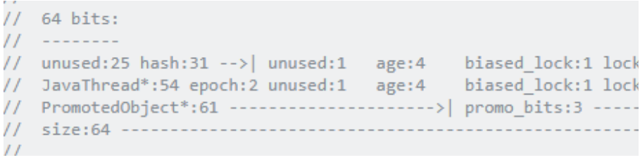

上图为 **Hotspot** 的源码种对对象头的注释,整理一下得出下表

|                   Object Header（128bits）                   |              |
| :----------------------------------------------------------: | :----------: |
|                   **Mark Word（64bits）**                    |  **State**   |
| unused: 25 \| identity_hashcode : 31 \| unused : 1 \| age : 4 \| biased_lock : 1 \| lock : 2 |  **Normal**  |
| thread : 54 \|             epoch : 2             \| unused : 1 \| age : 4 \| biased_lock : 1 \| lock : 2 |  **Biased**  |
| ptr_to_lock_record : 62                                             \| lock : 2 | **L locked** |
| ptr_to_heavyweight_monitor : 62                                 \| lock : 2 | **H Locked** |
|                         \| lock : 2                          |    **GC**    |

**L locked**（**Lightweight Locked**）,**H Locked**（**Heavyweight Locked**）

#### Mark_Word

**Mark Word** 用于存储对象自身的运行时数据，64位 **JVM** 为 **64bits**，**8个字节**：

- **thread** ：偏向线程ID，**54 bits**
- **identity_hashcode** ：哈希码（**HashCode**），**31 bits**
- **epoch** ：偏向时间戳，**2 bits**
- **age** ：GC分代年龄，**4 bits**
- **biased_lock** ：偏向锁的标识位，**1 bit**
-  **lock** ： 线程持有的锁，**2 bits**

通过整理可以看出，**Mark_Word** 里面有三个 **3bits** 和锁紧密有关。这里可以解释为什么讲 **synchronized** 所产生的锁要理解对象头，**因为 synchronized 关键字锁住的是对象，不是代码块，而体现就在对象头里面，所有很有必要了解一下对象头**。

#### 对象的状态

表格列出了**5种**对象状态，其实对象状态对象只有三种：

- **无锁状态**（**Normal**）
- **有锁状态**
- **GC标记状态 （GC）**

有锁状态又分为三种：

- **偏向锁（Biased）**
- **轻量锁（Lightweight Locked）**
- **重量锁（Heavyweight Locked）**

总的来说一共有五种状态，但是 **lock** 只有 **2bits** 的二进制数，最多只能表示4种状态，所以这里多加了1bit **biased_lock**，表示偏向锁。


### 分析JOL（Java Object Layout）

**Hotspot**虚拟机中，对象在内存中的布局分为三块区域：**对象头、实例数据和对齐填充**。


#### JOL工具包

如需要看到上述这些数据，需要借助一个工具包 [**JOL（Java Object Layout）**](http://openjdk.java.net/projects/code-tools/jol/)

```
JOL (Java Object Layout) is the tiny toolbox to analyze object layout schemes in JVMs. These tools are using Unsafe, JVMTI, and Serviceability Agent (SA) heavily to decoder the actual object layout, footprint, and references. This makes JOL much more accurate than other tools relying on heap dumps, specification assumptions, etc.
```

一个借助 Java 多项技术，解析出 Java 对象在内存布局的工具包。

导入Maven包

```xml
<!-- https://mvnrepository.com/artifact/org.openjdk.jol/jol-core -->
<dependency>
    <groupId>org.openjdk.jol</groupId>
    <artifactId>jol-core</artifactId>
    <version>0.10</version>
</dependency>
```

打印一个对象信息

```java
import org.openjdk.jol.info.ClassLayout;
import org.openjdk.jol.vm.VM;

import java.awt.*;

public class JOLExample {

    public static void main(String[] args) {

        One one = new One();

        // 打印当前 JVM 虚拟机信息
        System.out.println(VM.current().details());

        // 打印实例化对象信息
        System.out.println(ClassLayout.parseInstance(one).toPrintable());

    }
}
```

输出

```
# Running 64-bit HotSpot VM.
# Using compressed oop with 0-bit shift.
# Using compressed klass with 3-bit shift.
# Objects are 8 bytes aligned.
# Field sizes by type: 4, 1, 1, 2, 2, 4, 4, 8, 8 [bytes]
# Array element sizes: 4, 1, 1, 2, 2, 4, 4, 8, 8 [bytes]

com.Playwi0.Third.One object internals:
OFFSET SIZE   TYPE         DESCRIPTION                 VALUE
  0   4   (object header)  01 00 00 00 (00000001 00000000 00000000 00000000) (1)
  4   4   (object header)  00 00 00 00 (00000000 00000000 00000000 00000000) (0)
  8   4   (object header)  43 c1 00 20 (01000011 11000001 00000000 00100000) (536920387)
  12  4   (loss due to the next object alignment)

Instance size: 16 bytes
Space losses: 0 bytes internal + 4 bytes external = 4 bytes total
```

分析

```
# Field sizes by type: 4, 1, 1, 2, 2, 4, 4, 8, 8 [bytes]
# 分别对应[Oop(Object Original Pointer), boolean, byte, char, short, int, float, long, double]的大小

# Array element sizes: 4, 1, 1, 2, 2, 4, 4, 8, 8 [bytes] 
# 数组中元素的大小，分别对应的是[Oop(Object Original Pointer), boolean, byte, char, short, int, float, long, double]
```

这部分主要是用来优化 **Field** 的排序，节省内存空间。

```
com.Playwi0.Third.One object internals:
OFFSET SIZE   TYPE         DESCRIPTION                 VALUE
  0   4   (object header)  01 00 00 00 (00000001 00000000 00000000 00000000) (1)
  4   4   (object header)  00 00 00 00 (00000000 00000000 00000000 00000000) (0)
  8   4   (object header)  43 c1 00 20 (01000011 11000001 00000000 00100000) (536920387)
  12  4   (loss due to the next object alignment)

Instance size: 16 bytes
```

通过这部分，可以确确了解到一个空对象在内存中占 **16 bytes**，对象头为 **12 bytes**，还有 **4 bytes** 是对齐字节，因为 JVM 上规定对象都是**以8 bytes的粒度来对齐的**，所以对象头占了 12 bytes，需要补齐 4bytes，一共 16 bytes。

#### 实例数据

往对象里面添加数据

```
public class One {

    private int i = 1;
    
    private boolean flag = true;
}
```

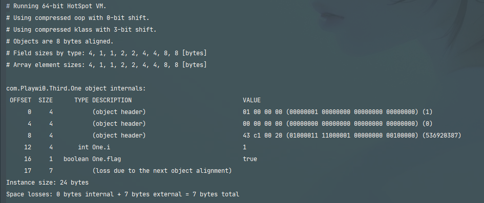

可以看到下面有两行打印出对象的实例数据，按照前面所说，**int** 类型数据大小对应 **4 bytes**， **boolean** 类型为 **1bytes** ，多出 **5 bytes**，加上对象头 **12 bytes**，总共 **17 bytes**，因为对象都是**以8 bytes的粒度来对齐的**，所以补了 **7 bytes **对齐数据，全部加起来一共 **24 bytes**。

#### 对象头

知道了**实例数据**和**对齐字节**的意义，那么继续探究对象头。对齐字节存在的意义是弥补实例数据所带来差额，而对象数据大小并不会改变，只有**12 bytes**。

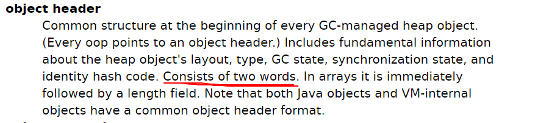

在**Hotspot术语表**对**Object header**解释：由两个 **words** 组成。除去前面已经解释过一个： **Mark_Word**。

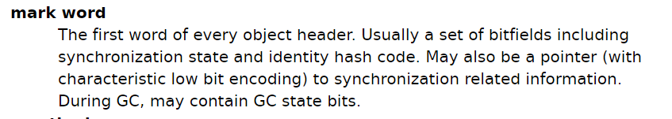

还有一个 **Klass_Word**

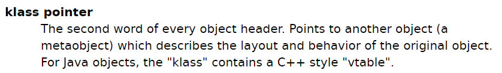

该部分占 **4 bytes**（**Mark_Word 占 8 bytes**），并且该部分指向的是**对象的元数据**，就是JVM通过这个指针确定对象是哪个类的实例（猜测，依据是**同一个类实例化出来的对象，该值一样**）。

```
public class JOLExample {

    public static void main(String[] args) {

        One one = new One();
        One two = new One();
        
        // 打印实例化对象信息
        System.out.println("Object one");
        System.out.println(ClassLayout.parseInstance(one).toPrintable());
        
        System.out.println("Object two");
        System.out.println(ClassLayout.parseInstance(two).toPrintable());

    }
}
```

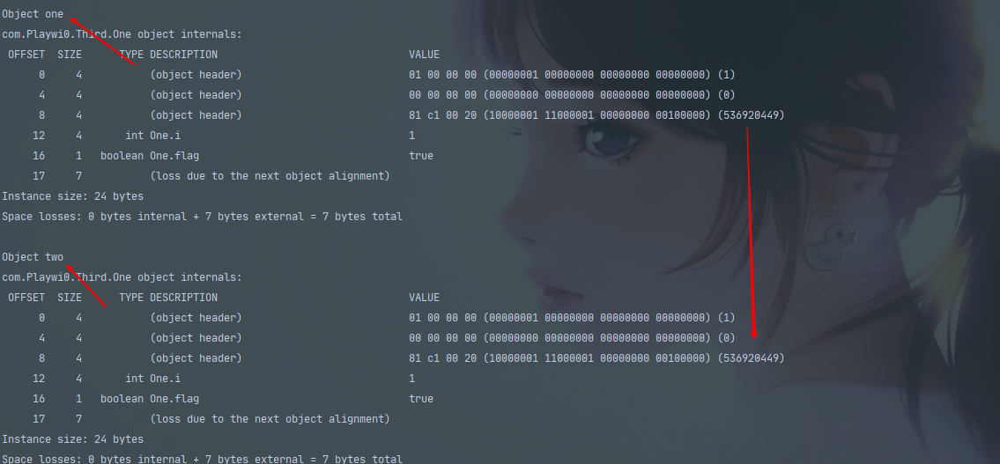

那么对象头的**words**结构是：

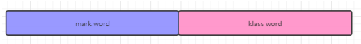

验证

```java
import org.openjdk.jol.info.ClassLayout;

public class JOLExample {

    public static void main(String[] args) {

        One one = new One();


        // 打印实例化对象信息
        System.out.println("before hashCode");
        System.out.println(ClassLayout.parseInstance(one).toPrintable());
		a
        // 打印对象16进制的hashCode
        System.out.println(Integer.toHexString(one.hashCode()));

        System.out.println("after hashCode");
        System.out.println(ClassLayout.parseInstance(one).toPrintable());

    }
}
```

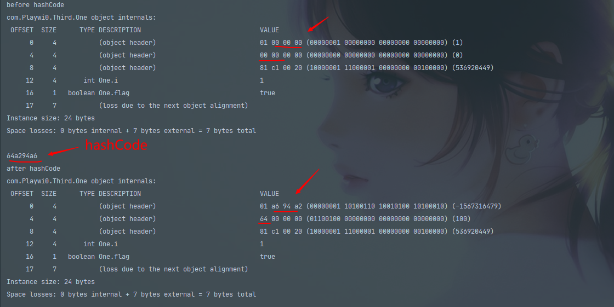

根据上面的表格，这是一个正常（**Normal，无锁状态**）的对象，其 **HashCode** 占 **31bits**，**unused** 占 **25bits**，

```
			unused							HashCode
00000000 00000000 00000000 0[1100100 10100010 10010100 10100110 00000001]
```

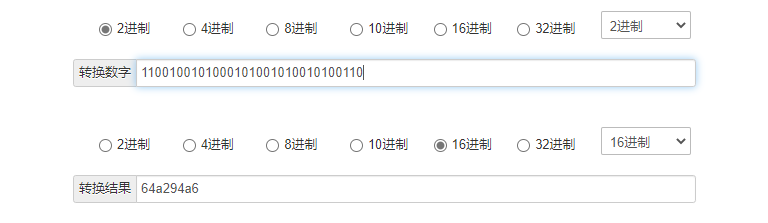

确实是**HashCode**值，但是为什么是反过来的？

这是因为[大小端模式]([https://baike.baidu.com/item/%E5%A4%A7%E5%B0%8F%E7%AB%AF%E6%A8%A1%E5%BC%8F/6750542?fr=aladdin](https://baike.baidu.com/item/大小端模式/6750542?fr=aladdin))。PC端一般是**小端模式**，也就是**指数据的高字节，保存在内存的低地址中，而数据的低字节，保存在内存的高地址中，这样的存储模式有点儿类似于把数据当作字符串顺序处理：地址由小向大增加，而数据从高位往低位放**。

接下只剩下 **1byte** ，也就是 **8 bits**，但它是**和锁有直接关系的部分**，也就是和 **synchronized** 关键字最紧密联系的部分，最直观感受到 **synchronized** 关键字锁住对象所带来的变化。根据表格，结构如下

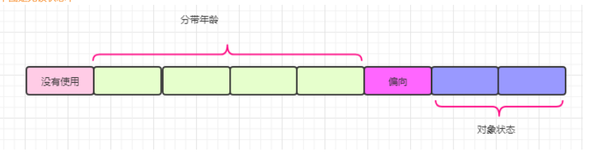

**8 bits** 中后 **3 bits** 直接表示五种对象状态，接下来探讨基本都是围绕这 **3 bits**


### 锁的原理

到这里，你对对像头已经有了基本的了解，接下来，就是慢慢揭开锁的面纱。

| 对象状态 | 1 bit  |  4 bits  | 1 bit | 2 bit |
| :------: | :----: | :------: | :---: | :---: |
|  无锁态  | unused | 分带年龄 |   0   |  01   |
|  偏向锁  |        |          |   1   |  01   |
| 轻量级锁 |        |          |       |  00   |
| 重量级锁 |        |          |       |  10   |
| GC 标记  |        |          |       |  11   |

前面已经列出了对象的五种状态，由 **3 bits** 表示。上表是五种状态的具体表示。


#### 无锁态

前面已经打印过了，对象 **one** 并没有进行任何加锁操作，所以前面 **8 bits** 是 **00000001**

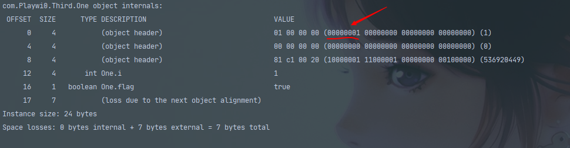


#### 偏向锁

什么是偏向锁？

**偏向锁是指一段同步代码一直被一个线程所访问，那么该线程会自动获取锁，降低获取锁的代价。**

在大多数情况下，锁不仅不存在多线程竞争，而且总是由同一个线程获得，为了让线程获得锁的代价更低从而提高性能，所以引入了偏向锁的概念。

JDK1.6之后 偏向锁默认开启偏向锁是锁状态中最乐观的一种锁：从始至终只有一个线程请求同一把锁。

##### 举例

```java
import org.openjdk.jol.info.ClassLayout;

public class JOLExample {

    public static void main(String[] args) {

        One one = new One();

        // 打印锁前对象信息
        System.out.println("before lock");
        System.out.println(ClassLayout.parseInstance(one).toPrintable());

        // 给对象上锁
        synchronized (one){

            // 对象已上锁信息
            System.out.println("locking");
            System.out.println(ClassLayout.parseInstance(one).toPrintable());

        }

        // 锁后对象信息
        System.out.println("after lock");
        System.out.println(ClassLayout.parseInstance(one).toPrintable());

    }
}
```

输出

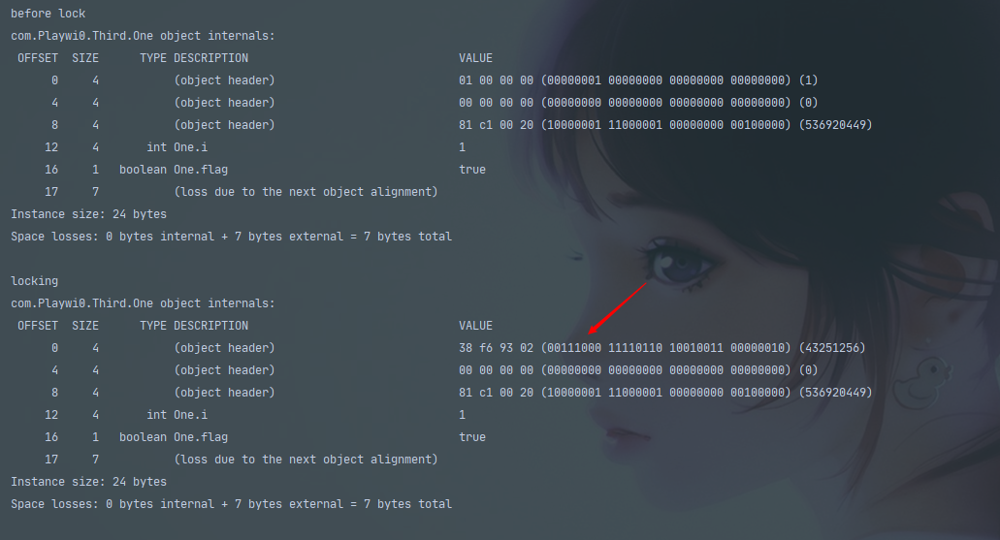

这里结果出乎，竟然不是偏向锁。难道前面所说的理论不对吗？

其实不是，**这是因为偏向有延时**，那为什么要有延时？

**JVM** 启动时会进行一系列的复杂活动，比如装载配置，系统类初始化等等。在这个过程中会使用大量**synchronized** 关键字对对象加锁，且这些锁大多数都不是偏向锁。为了减少初始化时间，**JVM 默认延时加载偏向锁**。

这个延时的时间大概为4s左右，具体时间因机器而异。可以在运行时加入参数查看 **JVM** 默认参数

```
java -XX:+PrintFlagsFinal
```


当然也可以修改 **JVM** 参数，来取消延时加载偏向锁。

```shel
java -XX:BiasedLockingStartupDelay=0		//毫秒
```

重新打印输出

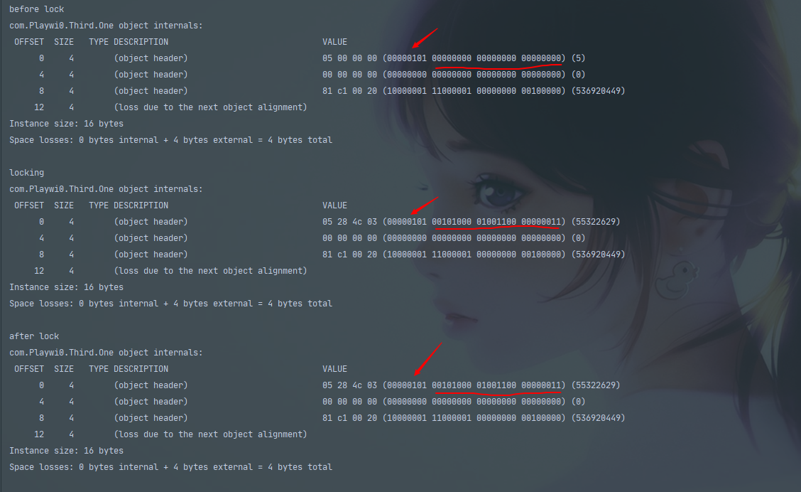

可以看到，偏向锁确实是偏向锁，但为什么加锁前后改变的是后面 **3 bytes**，还有，如果我设置了加载偏向锁的延时为 0，那么无锁状态呢？

回看之前对象头的表格，可以知道，偏向除了这个 **8 bits**，还有 **56 bits**，分别表示 **JavaThreadID（54 bits）和 epoch（2 bits）**


也就是说，在加锁之前，虽然也是显示偏向锁的状态，但是并不是真正的上了偏向锁，这个状态叫**可偏向状态（相当于无锁）**，是准备上偏向锁的阶段，所以后面的 **7 bytes** 全部是空值。

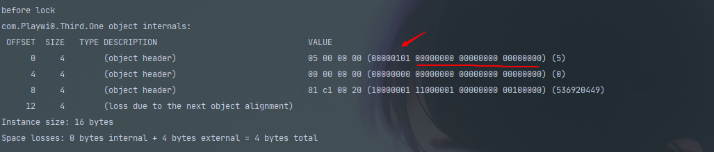

在使用 **synchronized** 关键字给对象上锁时，会检查该对象是否处于一个**可偏向状态**，如果是可偏向状态，则通过**CAS（旧的内存值：可偏向状态，预期值：可偏向状态，新值：线程ID）** 将原本空值修改为 **ThreadID和epoch**，这时候才是真正给对象上了锁。

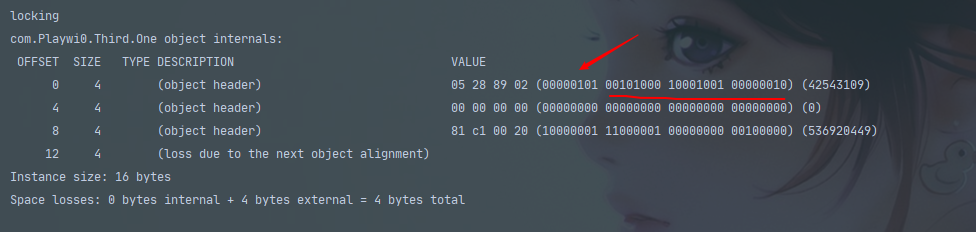

但是线程不会主动撤销偏向锁，偏向锁只有遇到其他线程尝试竞争偏向锁时，持有偏向锁的线程才会撤销锁。所以即使在同步代码块执行完成之后，对象还是偏向锁状态。而这样，如果下次还是该线程，那么直接会获得锁，不需要重新进入加锁过程，提高性能。

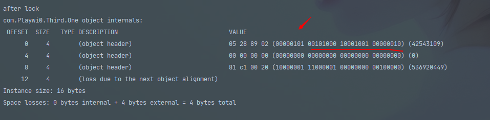

这里偏向锁的释放和撤销是两个概念：**撤销是指在获取偏向锁的过程因为不满足条件导致要将锁对象改为非偏向锁状态；释放是指退出同步块时的过程。**


#### 轻量级锁

轻量级锁是指**当锁是偏向锁或无锁（有延时）的时候，被另外的线程所访问，偏向锁或无锁（有延时）就会升级为轻量级锁**。

##### 举例

```java
package com.Playwi0.Third;

import org.openjdk.jol.info.ClassLayout;

public class JOLExample {

    private static final One one = new One();


    public static void main(String[] args) throws InterruptedException {

        // 打印锁前对象信息
        System.out.println("before");
        System.out.println(ClassLayout.parseInstance(one).toPrintable());

        Thread t1 = new Thread("t1") {

            @Override
            public void run() {
                // 给对象上锁
                synchronized (one){

                    // 对象已上锁信息
                        System.out.println("t1---locking");
                        System.out.println(ClassLayout.parseInstance(one).toPrintable());

                }
            }
        };

        Thread t2 = new Thread("t2") {

            @Override
            public void run() {
                // 给对象上锁
                synchronized (one){
                    // 对象已上锁信息
                    System.out.println("t2---locking");
                    System.out.println(ClassLayout.parseInstance(one).toPrintable());


                }

            }
        };

        t1.start();
        t1.join();

        t2.start();
        t2.join();


//         锁后对象信息
        System.out.println("after");
        System.out.println(ClassLayout.parseInstance(one).toPrintable());

    }
}

```

结果

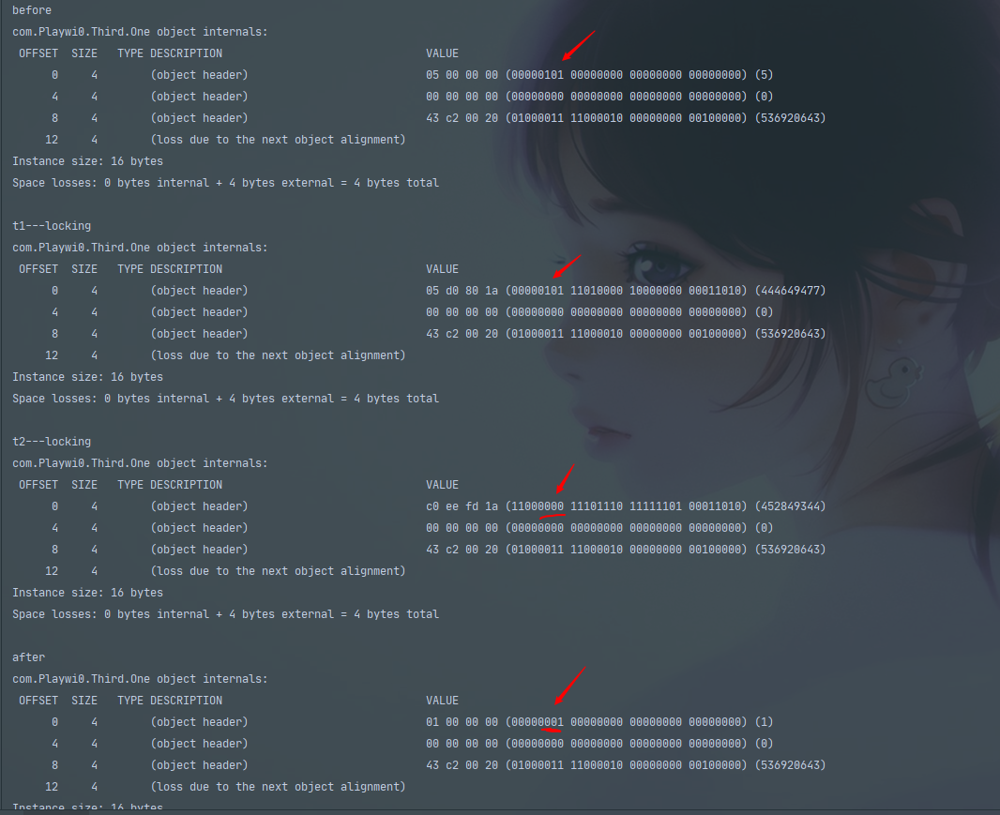

**分析：**

在**加锁前（before）**，因为已关闭延时，所以在加锁前是可偏向状态。

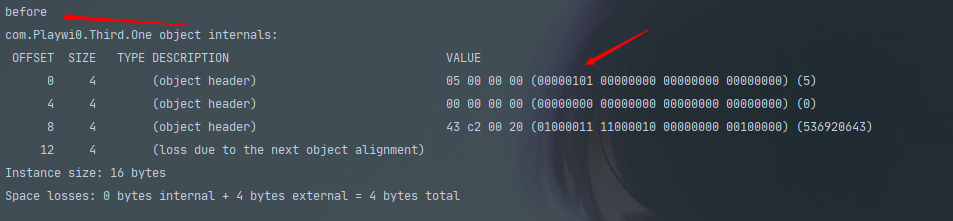

第一次是加锁，因为 **t1** 在 **t2** 启动之前用了 **join**，所以不存在多线程竞争，锁偏向 **t1** 线程。

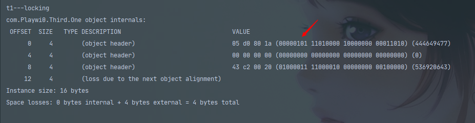

**t2** 启动要给对象加锁，可是对象已经是偏向锁了，又没达到重偏向条件（批量重偏向），并且持有偏向锁的线程已经死亡，所以膨胀为轻量级锁（有人说会重偏向t2，个人感觉不正确，后面会解释）。

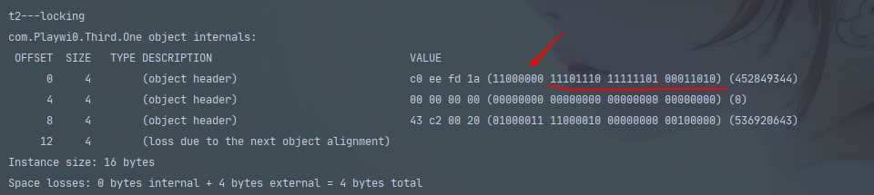

最后所有子线程死亡，轻量级锁会主动释放，对象变为无锁状态。

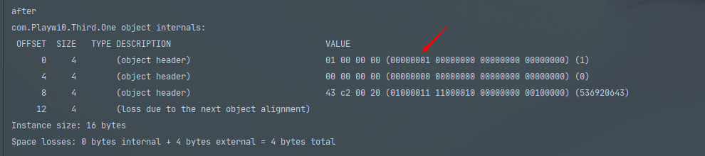

#### 重量级锁

重量级锁是**当锁是无锁（有延时）、偏向锁或轻量级锁的时候，多个线程同时竞争锁，当前锁就会升级重量锁，没有获取锁的线程就会进入阻塞等待唤醒。**

##### 举例

###### 无锁到重量级锁

开启轻量级锁的延时

```
package com.Playwi0.Third;

import org.openjdk.jol.info.ClassLayout;

public class JOLExample {

    private static final One one = new One();


    public static void main(String[] args) throws InterruptedException {

        // 打印锁前对象信息
        System.out.println("before\n" + ClassLayout.parseInstance(one).toPrintable());

        Thread t1 = new Thread("t1") {

            @Override
            public void run() {
                // 给对象上锁
                synchronized (one){

                    // 对象已上锁信息
                    System.out.println("t1---locking\n" + 						  
                    					ClassLayout.parseInstance(one).toPrintable());
                }
            }
        };

        Thread t2 = new Thread("t2") {

            @Override
            public void run() {
                // 给对象上锁
                synchronized (one){
                    // 对象已上锁信息
                    System.out.println("t2---locking\n" + 						  
                    					ClassLayout.parseInstance(one).toPrintable());

                }
            }
        };

        t1.start();
        t2.start();
        Thread.sleep(5000);
        
        // 锁后对象信息
        System.out.println("after\n" + ClassLayout.parseInstance(one).toPrintable());

    }
}

```

输出

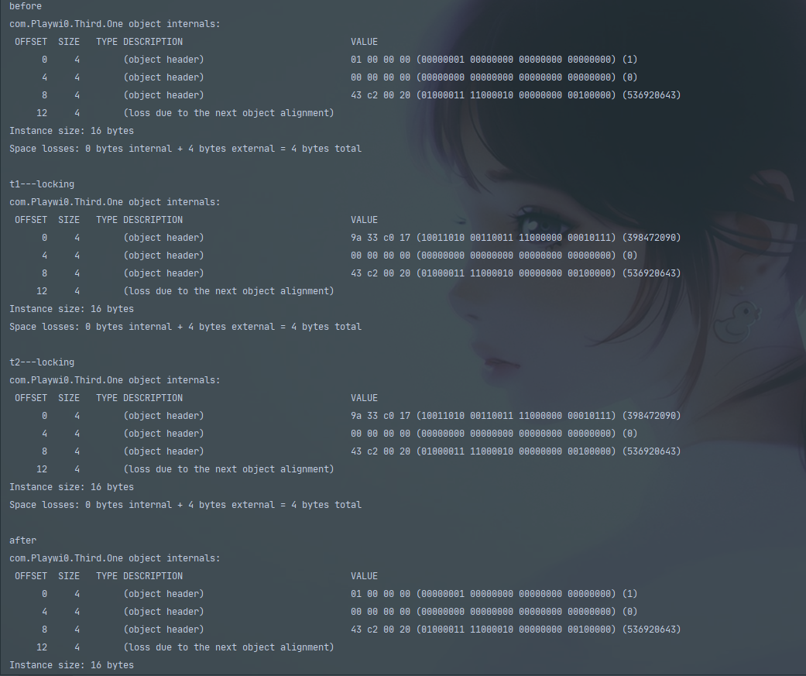


###### 偏向锁到重量级锁

关闭偏向锁的延时，代码同上


###### 轻量级锁到重量级锁

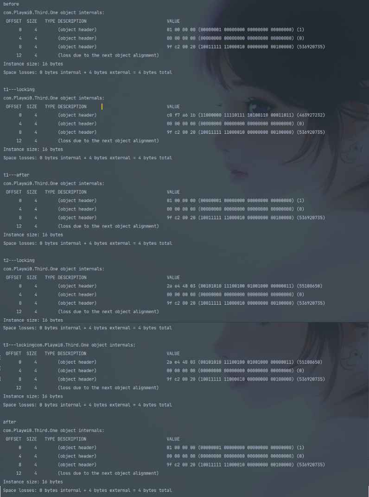

**分析**：

无论是哪种锁，多个线程同时竞争这把锁时，都会升级为重量锁，并且重量锁会主动释放


### 锁的膨胀

**流程图**

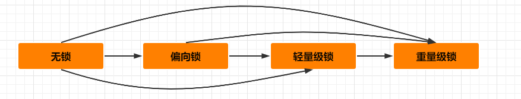

#### 无锁态的膨胀

##### 无锁到偏向锁

在关闭偏向锁延时时，无锁到可偏向状态只有在对象一开始未被加锁过的情况才会有。

可偏向状态下，**epoch** 字段是无效的(与锁对象对应的 **klass_word** 的 **mark_prototype** 的 **epoch** 值不匹配)，只有单个线程来拿锁，并且无竞争，**JVM** 会使用原子CAS指令（具体操不知），将可偏向状态偏向到当前线程ID。

##### 无锁到轻量锁

如果不关闭偏向锁延时，**JVM** 默认一开始对象状态是无锁的，也不会有可偏向状态。

如果对象为无锁状态（001），虚拟机首先将在当前线程的栈帧中建立一个名为锁记录（**Lock Record**）的空间，用于存储锁对象目前的 **Mark Word** 的拷贝。


然后拷贝对象头中的 **Mark Word** 复制到锁记录中。

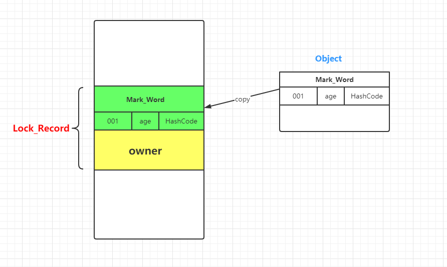

拷贝成功后，**JVM** 将使用 **CAS** 操作（具体未知）尝试将对象的 **Mark Word** 更新为指向 **Lock Record** 的指针，并将 **Lock Record** 里的**owner** 指针指向对象的 **Mark Word**。

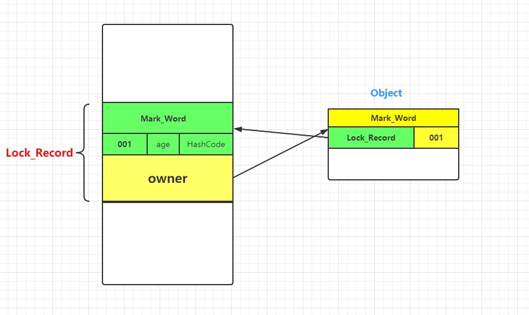

如果这个更新动作成功了，那么这个线程就拥有了该对象的锁，并且对象 **Mark Word** 的锁标志位设置为**“000”**，表示此对象处于轻量级锁定状态。

如果更新操作失败了，虚拟机首先会检查对象的 **Mark Word** 是否指向当前线程的栈帧，如果是就说明当前线程已经拥有了这个对象的锁，那就可以直接进入同步块继续执行，否则说明多个线程竞争锁。

##### 无锁到重量级锁

首先 **JVM** 会创建一个 **Monitor** （c++实现）

```c++
ObjectMonitor() {
    _header       = NULL;//mark_word 对象头
    _count        = 0;
    _waiters      = 0,//等待线程数
    _recursions   = 0;//重入次数
    _object       = NULL;//监视器锁寄生的对象。锁不是平白出现的，而是寄托存储于对象中。
    _owner        = NULL;//指向获得ObjectMonitor对象的线程或基础锁
    _WaitSet      = NULL;//处于wait状态的线程，会被加入到waitSet；
    _WaitSetLock  = 0;
    _Responsible  = NULL;
    _succ         = NULL;
    _cxq          = NULL;
    FreeNext      = NULL;
    _EntryList    = NULL;//处于等待锁block状态的线程，会被加入到entryList；
    _SpinFreq     = 0;
    _SpinClock    = 0;
    OwnerIsThread = 0;
    _previous_owner_tid = 0;//监视器前一个拥有者线程的ID
}
```

**Monitor** 的 **_header** 字段指向锁对象的 **Mark_Word**，**_object** 指向锁对象。

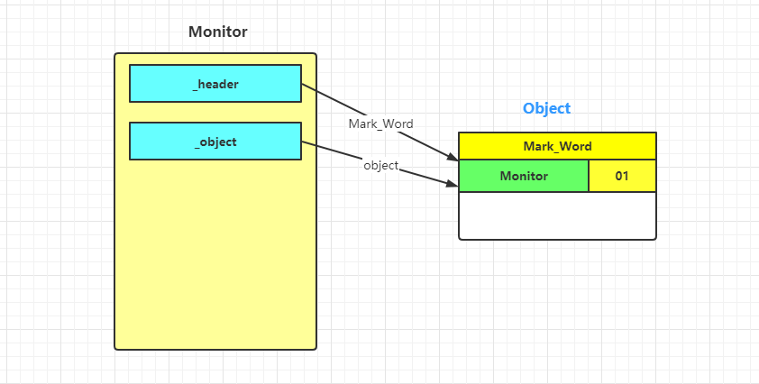

用 **CAS** 指令把 ** **Monitor** 指针替换到对象头的 **Mark_Word**

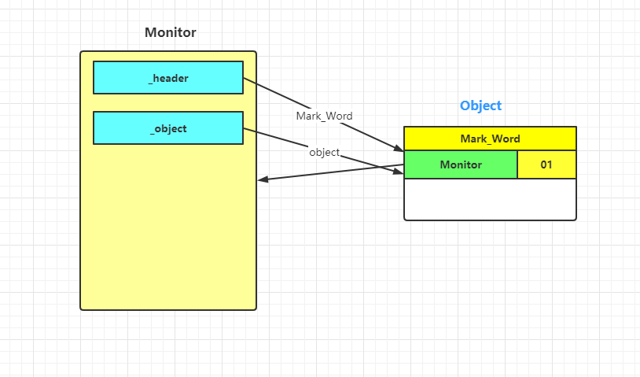

#### 偏向锁的膨胀

##### 偏向锁到轻量级锁

如果当前锁为偏向锁，当有其他线程再次需要锁该对象的时候，**JVM** 会等待一个全局安全点（在这个时间点上没有字节码正在执行），它会首先暂停拥有偏向锁的线程，判断该线程的状态（**JVM** 维护了一个集合存放所有存活的线程，通过遍历该集合判断某个线程是否存活）。

如果该线程已经**不存活**或**活着但不处于同步代码块中**（**synchronized** 锁住部分代码），则撤销偏向锁，设置对象头为无锁状态，然后膨胀到轻量锁（**逻辑与上面无锁一样**）。

如果线程仍然**活着且处于同步与块代码中**，**竞争升级**，恢复到无锁状态，偏向锁最终变为重量级锁（这个过程是先到轻量级锁，再到重量级锁，还是直接膨胀为重量级锁，目前未找到答案，膨胀过程与上面无锁一样）。

##### HashCode

如果当前锁对象已经 **HashCode**，则不存在**可偏向或偏向锁状态**。这是因为 **Mark_Word** 有冲突。

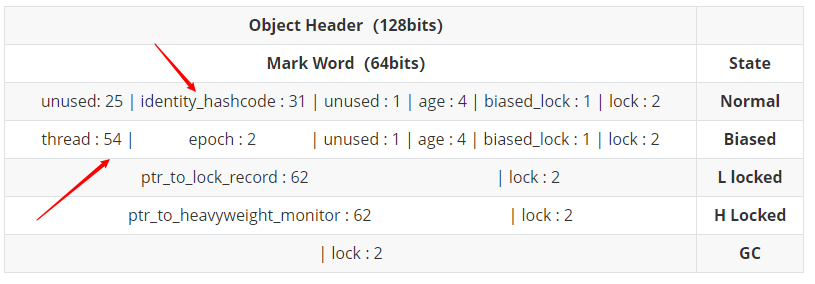

如果对象处于可偏向状态进行 **HashCode**，会变为无锁不可偏向状态，下次加锁为轻量锁。

```java
package com.Playwi0.Fourth;

import org.openjdk.jol.info.ClassLayout;

public class JOLExample {

    private static final Fourth fourth = new Fourth();

    public static void main(String[] args) throws InterruptedException {

        System.out.println("before hashCode\n" + 	
                           		ClassLayout.parseInstance(fourth).toPrintable());


        System.out.println("HashCode: " + fourth.hashCode());
        

        System.out.println("after hashCode\n" + 
                           		ClassLayout.parseInstance(fourth).toPrintable());
        
         Thread t1 = new Thread() {

            @Override
            public void run() {

                synchronized (fourth) {
                    System.out.println("t1---locking\n" + 
                                       ClassLayout.parseInstance(fourth).toPrintable());
                }
            }
        };

        t1.start();
        t1.join();

        System.out.println("after hashCode\n" + 
                           		ClassLayout.parseInstance(fourth).toPrintable());
    }
}
```

结果

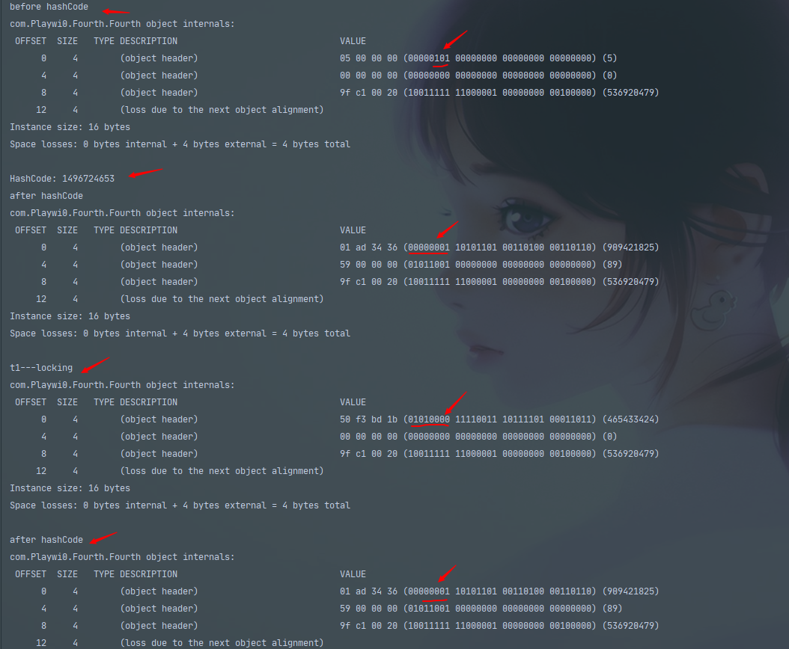

如果对象处于偏向锁状态且处于同步代码块的执行中 **HashCode**，则锁会膨胀为重量级锁。

```java
package com.Playwi0.Fourth;

import org.openjdk.jol.info.ClassLayout;

public class JOLExample {

    private static final Fourth fourth = new Fourth();

    public static void main(String[] args) throws InterruptedException {

        System.out.println("before t1\n" + 
                           	ClassLayout.parseInstance(fourth).toPrintable());

        Thread t1 = new Thread() {

            @Override
            public void run() {

                synchronized (fourth) {
                    System.out.println("t1---before\n" + 	
                                       	ClassLayout.parseInstance(fourth).toPrintable());
                    
                    System.out.println("HashCode: " + fourth.hashCode() + "\n");
                    
                    System.out.println("t1---after\n" + 
                                       	ClassLayout.parseInstance(fourth).toPrintable());
                }
            }
        };

        t1.start();
        t1.join();

    }
}
```

结果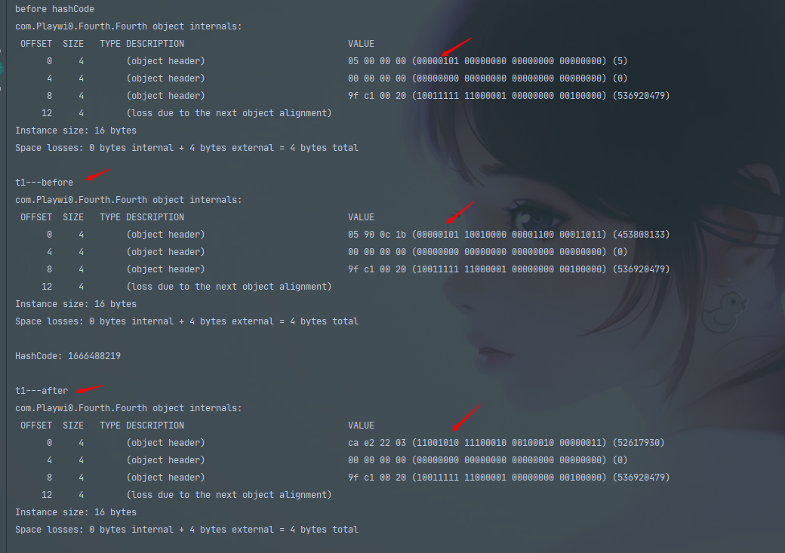

##### 重偏向（不存在）

重偏向是指当前线程释放偏向锁，下一个线程来拿锁，偏向锁会重新偏向。但这种情况是不存在，重偏向只会在**批量重偏向**（下面讲）才会出现。那这个名词怎么提出来的。

```java
package com.Playwi0.Fourth;

import org.openjdk.jol.info.ClassLayout;

public class JOLExample {

    private static final Fourth fourth = new Fourth();

    public static void main(String[] args) throws InterruptedException {


        System.out.println("before\n" +
                                    ClassLayout.parseInstance(fourth).toPrintable());


        Thread t1 = new Thread("t1") {

            @Override
            public void run() {

                synchronized (fourth) {
                    System.out.println("t1---locking\n" + 
                                       	ClassLayout.parseInstance(fourth).toPrintable());
                }

            }

        };

        Thread t2 = new Thread("t2") {

            @Override
            public void run() {

                synchronized (fourth) {
                    System.out.println("t2---locking\n" + 
                                       	ClassLayout.parseInstance(fourth).toPrintable());
                }

            }

        };

        t1.start();
        t1.join();

        t2.start();

    }
}
```

结果

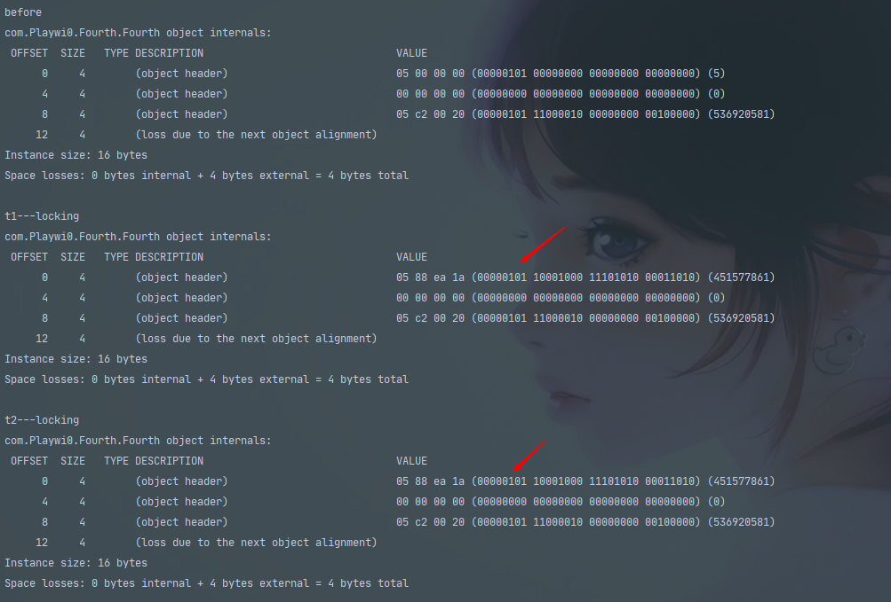

这一看确实还是偏向锁，重新偏向了 **t2** ，但再仔细一看。

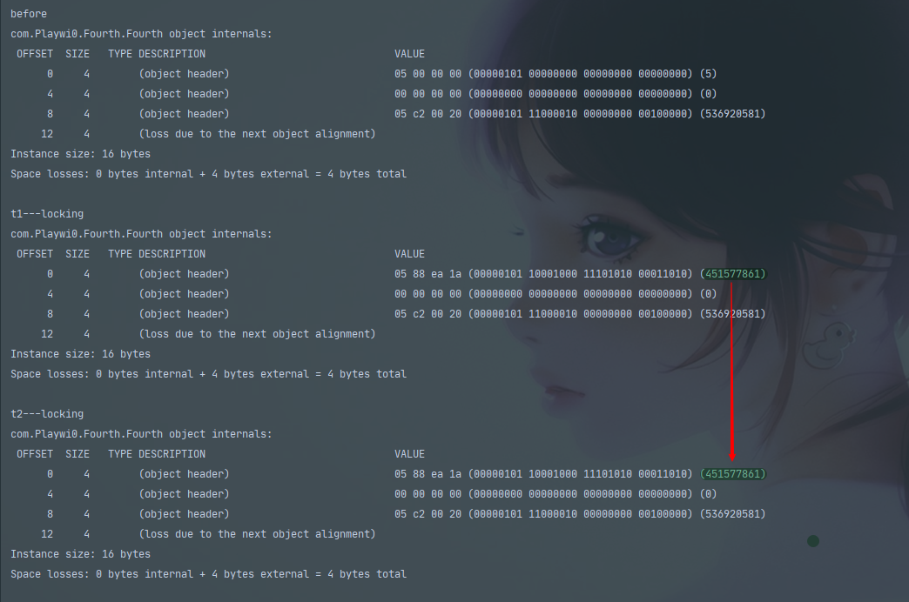

**ThreadID（系统分配还是 JVM 分配未知）**一样，在这里可以做个推测。t1 死亡之后，再次分配（**是JVM还是系统分配，目前不清楚**）给 t2 的 ID 和 t1 的一样，因此偏向锁以为是同一个线程，继续执行，不会膨胀。

**举个反例**

```java
package com.Playwi0.Fourth;

import org.openjdk.jol.info.ClassLayout;

public class JOLExample {

    private static final Fourth fourth = new Fourth();

    public static void main(String[] args) throws InterruptedException {


        System.out.println("before\n" +
                                    ClassLayout.parseInstance(fourth).toPrintable());


        Thread t1 = new Thread("t1") {

            @Override
            public void run() {

                synchronized (fourth) {
                    System.out.println("t1---locking\n" + 
                                       ClassLayout.parseInstance(fourth).toPrintable());
                }
				
                // 睡眠5秒，让 t2 执行时，t1 保持不死
                try {
                    Thread.sleep(5000);
                } catch (InterruptedException e) {
                    e.printStackTrace();
                }

            }

        };
		
        Thread t2 = new Thread("t2") {

            @Override
            public void run() {

                synchronized (fourth) {
                    System.out.println("t2---locking\n" + 
                                       ClassLayout.parseInstance(fourth).toPrintable());
                }

            }

        };


        t1.start();

        // 睡眠一秒，让 t1 执行完同步代码块，再启动 t2
        Thread.sleep(1000);

        t2.start();

    }
}

```

这样写主要时保证 **t2** 执行的时候，**t1** 还活着，这样他俩的线程 ID 就不会一样。

结果

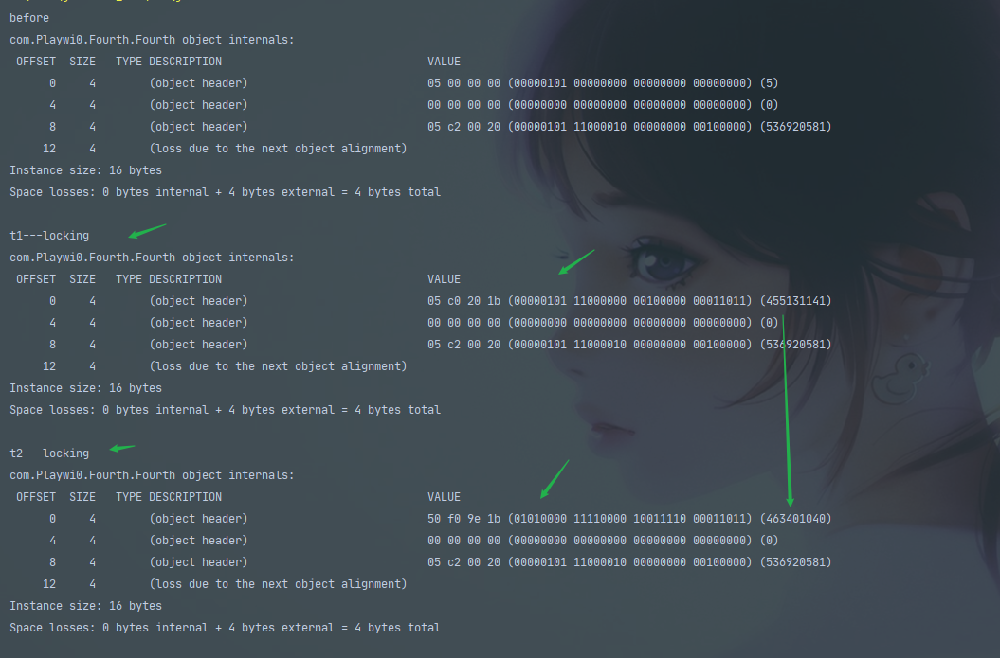

结果很明显，**线程ID**不一样，符合上面描述的锁膨胀的过程，并不存在重偏向。


##### 批量重偏向

当一个线程创建**大量对象**被用来作为锁对象，之后某个线程又使用这些对象作为锁对象，那么在这期间就会大量的上锁和撤销锁的操作，这样做大大降低效率，违背了优化的初衷。

为了解决这个问题，JVM 每次在撤销偏向锁的时候，以class为单位，为每个class维护一个偏向锁撤销计数器，每次撤销偏向锁，该计数器 +1，当这个值达到重偏向阈值（默认20）时，可以运行时加入一下命令查看。

```java
java -XX:+PrintFlagsFinal
```


JVM就认为该 **class** 产生对象的偏向锁有问题，因此会进行批量重偏向。

```java
package com.Playwi0.Fourth;

import org.openjdk.jol.info.ClassLayout;

import java.util.ArrayList;

public class RebiasThread {

    private static final ArrayList<Fourth> fourths = new ArrayList<Fourth>(70);

    public static void t1(){

        Thread t1 = new Thread("t1") {

            @Override
            public void run() {

                for (Fourth fourth : fourths) {

                    synchronized (fourth) {

                        if (fourths.get(18) == fourth) {

                            System.out.println("t1 locking----19\n" +
                                    ClassLayout.parseInstance(fourth).toPrintable());
                        }

                        if (fourths.get(19) == fourth) {

                            System.out.println("t1 locking----20\n" +
                                    ClassLayout.parseInstance(fourth).toPrintable());
                        }

                        if (fourths.get(20) == fourth) {

                            System.out.println("t1 locking----21\n" +
                                    ClassLayout.parseInstance(fourth).toPrintable());
                        }
                    }
                }

                // 保持线程不死
                try {
                    Thread.sleep(10000);
                } catch (InterruptedException e) {
                    e.printStackTrace();
                }
            }
        };
        t1.start();
    }

    public static void t2(){

        Thread t2 = new Thread("t2") {

            @Override
            public void run() {

                for (Fourth fourth : fourths) {

                    synchronized (fourth) {

                        if (fourths.get(18) == fourth) {

                            System.out.println("t2 locking----19\n" +
                                    ClassLayout.parseInstance(fourth).toPrintable());
                        }

                        if (fourths.get(19) == fourth) {

                            System.out.println("t2 locking----20\n" +
                                    ClassLayout.parseInstance(fourth).toPrintable());
                        }


                        if (fourths.get(20) == fourth) {

                            System.out.println("t1 locking----21\n" +
                                    ClassLayout.parseInstance(fourth).toPrintable());
                        }

                    }
                }
            }
        };

        t2.start();
    }

    public static void main(String[] args) throws InterruptedException {

        for (int i = 0; i < 50; i++) {

            fourths.add(new Fourth());
        }

        t1();

        // 让 t1 for循环执行完
        Thread.sleep(5000);

        t2();


    }
}

```

**结果**

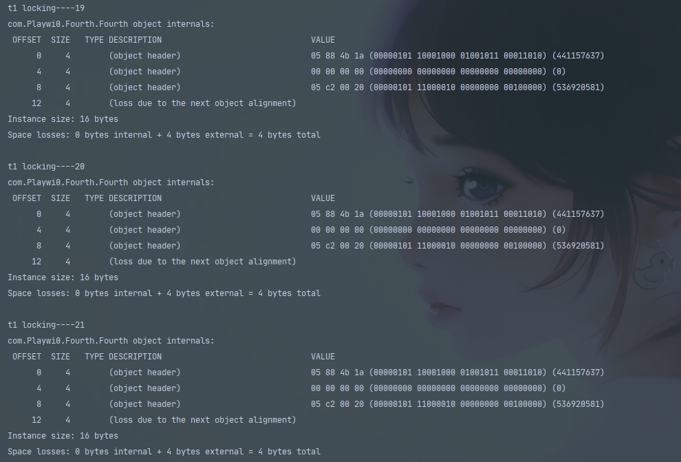

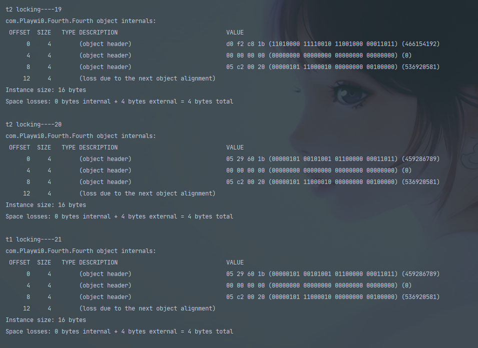

**分析：**

t1 线程里的第19、20、21全部是偏向锁，符合预期。

t2 线程里第19个还是轻量锁，但第20，21已经开始批量重偏向，注意 t1 的第20、21锁对象的Thread ID和 t2 是不一样，证明他们已经重偏向了。

当到达开始批量重偏向阈值时，每个偏向锁对象的 **Mark_Word** 中的 **epoch** 字段（它的初始值是创建对象时**class** 中的 **epoch** 值），

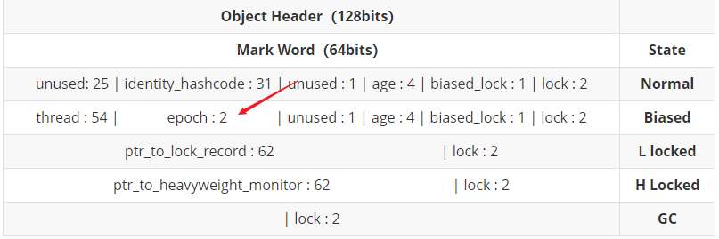

每次发生批量重偏向时，就将该值+1，同时遍历JVM中所有线程的栈，找到该 class 产生的对象所有正处于加锁状态的偏向锁，将其 **epoch** 字段改为新值。下次获得锁时，发现当前对象的 **epoch** 值和 class 的 **epoch** 不相等，那就算当前已经偏向了其他线程，也不会执行撤销操作，而是直接通过CAS操作将其 **Mark_Word** 的 **ThreadID** 改成当前线程IID。


##### 批量撤销

虽然有批量重偏向，但JVM不会一直重偏向下去，和前面批量重偏向机制一样，重偏向一次计数器+1，到达撤销阈值之后，


JVM认为存在多线程竞争，会标记该class为不可偏向，开始批量撤销，膨胀。


#### 轻量级锁的膨胀

##### 轻量级锁到重量级锁

膨胀到重量锁一般是因为**多个线程同时竞争同一把锁**，锁才会膨胀到重量级锁。

轻量级锁首先会释放锁，成为无锁状态，再膨胀为重量级锁，中间过程与上面的无锁到重量级锁类似。


### 性能对比

说那么多，是骡子是马，拿出来溜一溜就知道，**show your code**

从0开始加到一个1个亿，看看三种不同级别锁，性能如何。（这里结果取决个人电脑，测个大概就行就行）

#### 偏向锁

```java
package com.Playwi0.Fourth;

public class Compared {

    public static void run(){

        Fourth fourth = new Fourth();

        long start = System.currentTimeMillis();

        for (long i = 0; i < 100000000l; i++) {
            fourth.add();
        }

        long end = System.currentTimeMillis();

        System.out.println("Time: " + String.format("%sms", end - start));
    }

    public static void main(String[] args) {

        run();
    }
    
}
```

关闭延时，结果

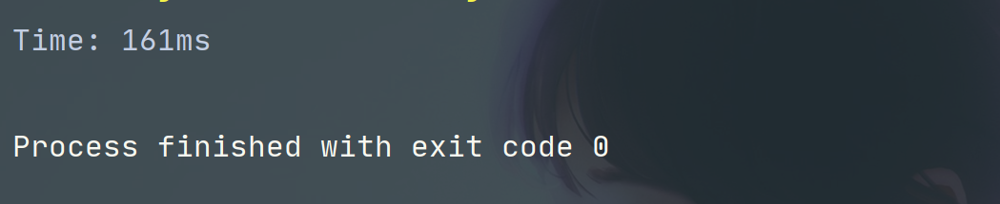


#### 轻量级锁

代码同上，开启延时，结果

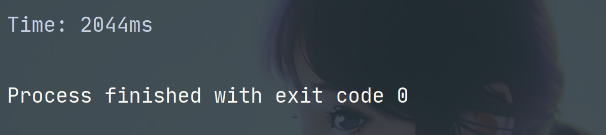

轻量锁与偏向锁性能差距可以达到 **10倍** 左右，说明优化还是很有必要


### 总结

**synchronized** 关键字可是 **sun** 公司的亲儿子，所做的优化不仅仅是上面说的这么简单，作者水平有限，无法处处拿出证明，只能扯扯理论，仅仅代表作者自己的观点，不足之处还请指出。


### 参考资料

- [**Hotspot术语表**](http://openjdk.java.net/groups/hotspot/docs/HotSpotGlossary.html)
- [死磕Synchronized底层实现--概论]([http://www.java520.cn/%E5%A4%9A%E7%BA%BF%E7%A8%8B/94.html](http://www.java520.cn/多线程/94.html))
- [死磕Synchronized底层实现--偏向锁]([https://www.java520.cn/%e5%a4%9a%e7%ba%bf%e7%a8%8b/96.html](https://www.java520.cn/多线程/96.html))
- [死磕Synchronized底层实现--轻量级锁]([https://www.java520.cn/%e5%a4%9a%e7%ba%bf%e7%a8%8b/99.html](https://www.java520.cn/多线程/99.html))
- [死磕Synchronized底层实现--重量级锁](https://blog.51cto.com/14440216/2427707)
- [不可不说的Java“锁”事](https://tech.meituan.com/2018/11/15/java-lock.html)

